:orphan:

.. _basic-use:

###########################
Nion Swift Quickstart Guide
###########################
This quickstart guide will provide you with a quick tutorial on how to use the most important features of Nion Swift. For more in-depth explanations, please see the full :ref:`user-guide`.

*******************
Intro to Nion Swift
*******************
Nion Swift is an image processing software for controlling instruments, and managing the acquisition, organization, visualization, and analysis of data. The software was designed to be used in conjunction with Nion's electron microscopes, but the functionality and the ability to extend its capabilities using Python mean that Nion Swift is useful for any number of data visualization projects. Whether you already have your data, or you want to see the data as it is acquired, Nion Swift helps you visualize your data in exactly the way you want.

Click to download Nion Swift or for :ref:`installation` instructions.

In this tutorial, we will walk through the process of generating, manipulating, and exporting data. You will learn how to manage the workspace, add graphics, work with various utility panels, and more. Through this process, you will also get a more general sense of how the workspace and utility panels work side by side to create a working environment.

To begin, let's create a blank project.

**********************
Creating a New Project
**********************
Start by launching the Nion Swift application. If this is the first time the application has been opened on your computer, a project selection screen will appear. Click “New Project…” to begin.

.. image:: graphics/choose_project.png
    :width: 450
    :alt: Choose Project
    :align: center

Only one project can be open at a time. If Nion Swift has been opened before, the last active project will open. In this case, use the menu item [File -> New Project…] to start a new project. You should now see a blank project that looks similar to the image below.

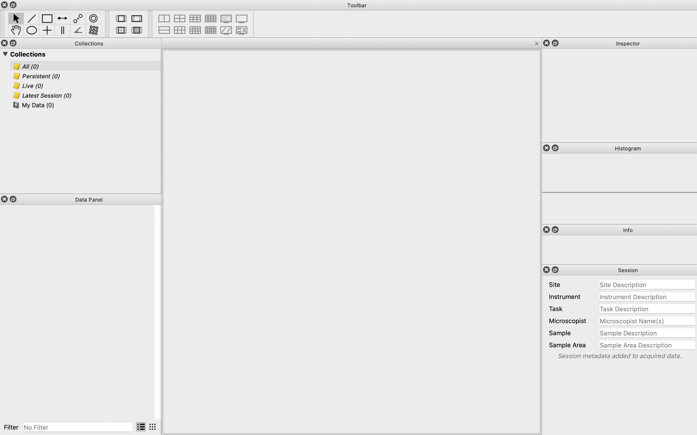

****************
Using Nion Swift
****************
Before we start working with data, we need to understand how the window is set up. There are two distinct parts of your project window: the workspace and the utility panels. Very generally, the workspace is where your data will be shown and edited in the form of images and line plots, and the utility panels are for viewing and editing data, variables, settings, and information.

.. image:: graphics/workspace_layout.png
    :width: 937
    :alt: Workspace Layout
    :align: center

The Workspace
=============
The workspace in the center of the window is where the data is displayed visually. By default, the workspace contains one large display panel. Display panels show data and allow you to add graphics, markers, and more to select specific parts of the data that you want to focus on. To show how to use the workspace, we will generate some random data to work with. Generate data by using the menu item [Processing > Generate Data…].

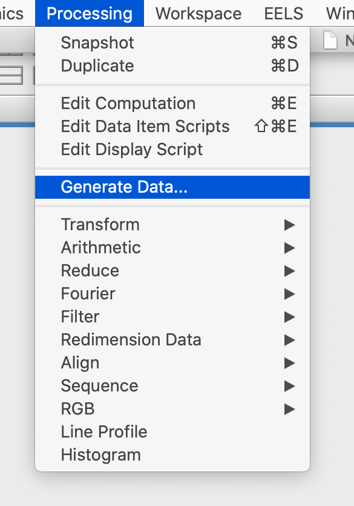

Then, click "Generate" in the pop-up window. Doing this automatically displays the new data in the empty display panel in the center of the window. Do not edit any of the numbers in the Generate pop-up window for now.

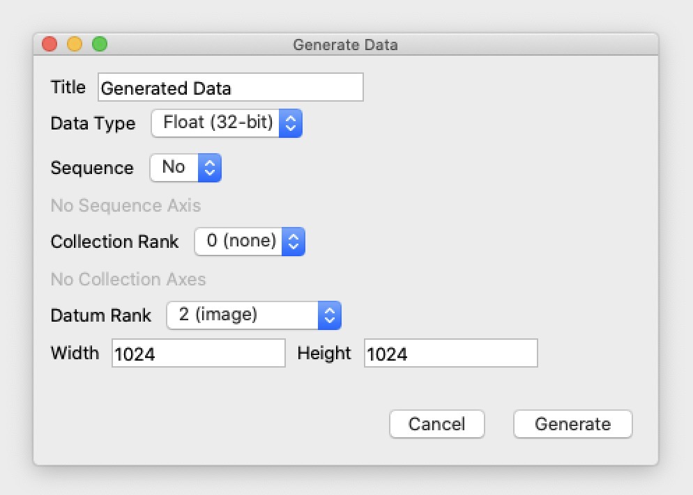

You should now see a black and white image in the data panel. This is the newly generated data.

You can split the workspace into multiple display panels to view data side by side. Try splitting the workspace into four display panels by clicking the Split 2x2 button in the toolbar.

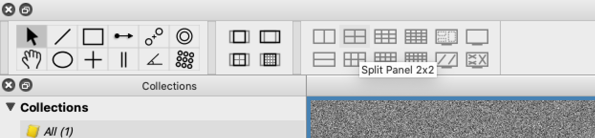

Utility Panels 
==============
In the areas surrounding the center workspace are many utility panels that contribute to the functionality of the software. Utility panels each have their own function and they can be rearranged or hidden to customize your window.

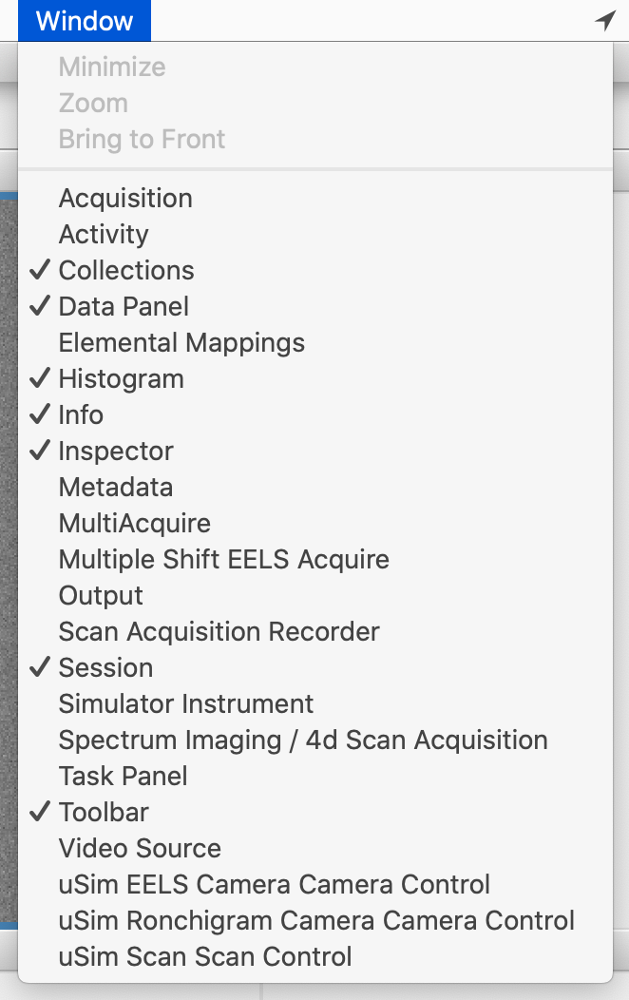

There are several ways to customize your window. Choose to show or hide a utility panel by using the [Window] menu item. Once you have selected the panels to show, you can rearrange the layout of the utility panels by clicking and dragging on each panel's title bar. 

Panels can have their own space in the layout, be popped out into their own window, and can even be layered by dropping one panel on top of another. 

To quickly hide a panel, click the x button in the panel's upper left corner. To resize a panel, click and drag from one of its edges.

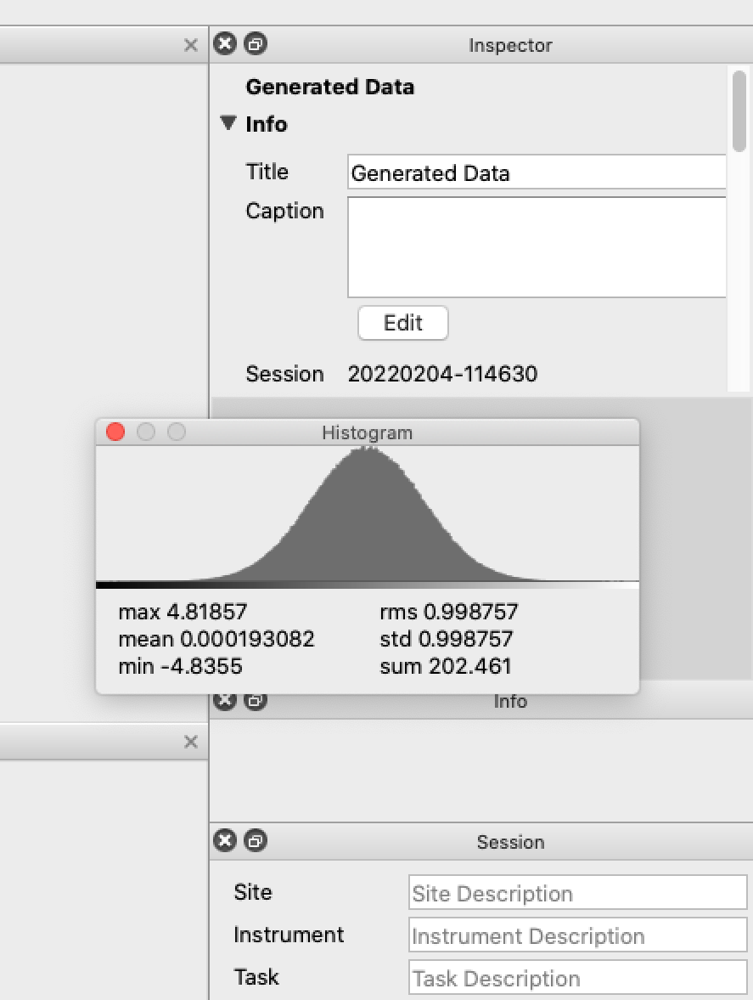

Now, let's take a look at the capabilities of some of the utility panels.

Data Panel
----------
The data panel is one of the most important panels; it shows all of the data items currently stored in the project in a list on the left side of the workspace. 

Any data item listed in the data panel can be displayed in a display panel by dragging the data item into an empty display panel. This is the main way in which you will be able to manipulate your data. When a data item is displayed in a display panel, you can add graphics, edit calibrations, focus on specific regions and more. 

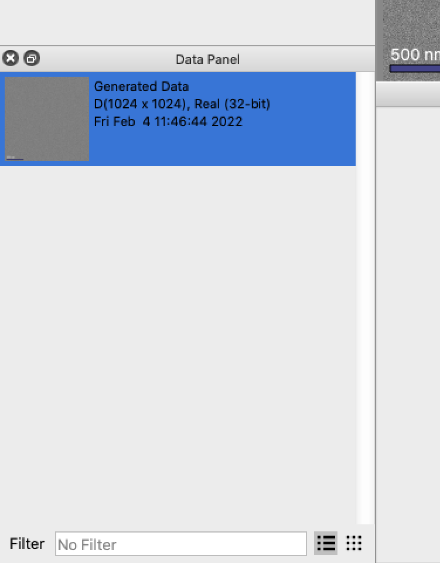

Inspector Panel
---------------
The inspector panel allows you to view some information and edit several settings about the selected item. By selecting a display panel displaying a data item, the inspector will present you with options like the name and description of the data item and the calibration of the axes.

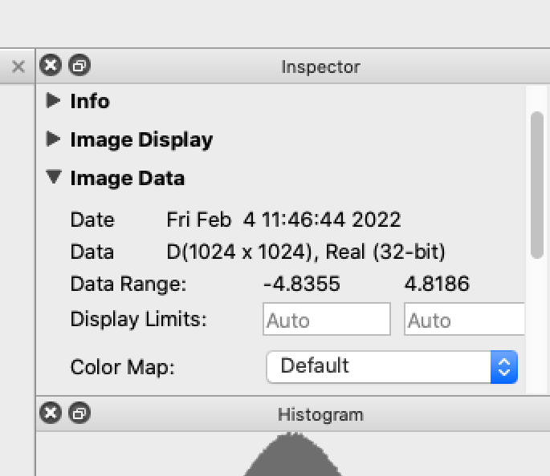

Let's change the color map for the generated data we have. Select the display panel showing the original generated data. Under the Image Data subsection in the inspector panel, select a new choice in the Color Map combo box to change the color map of the selected data.

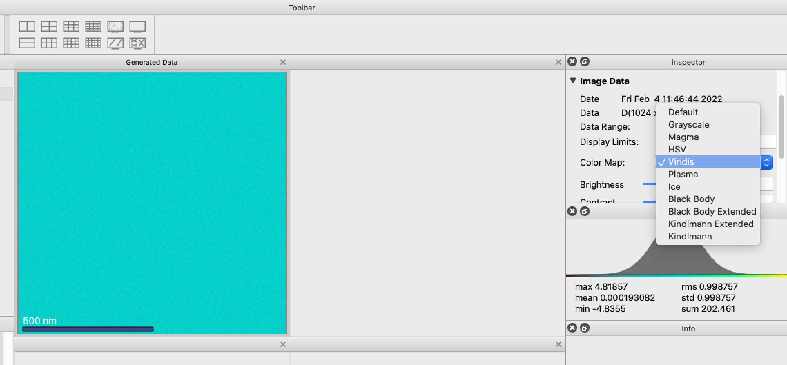

Info Panel
----------
The Info panel displays the current position and value of the data under the cursor. If it's not already visible, show the info panel by using the [Window] menu item and clicking on Info. Then, hover the cursor over the generated data. The info panel will display the value and position of the cursor. 

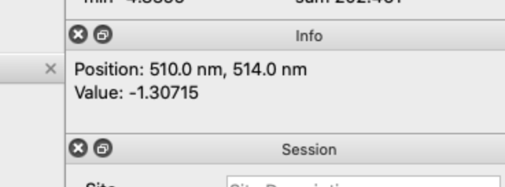

Histogram
---------
The Histogram panel allows you to see the data in a different way. The histogram will always show the data for the selected item. 

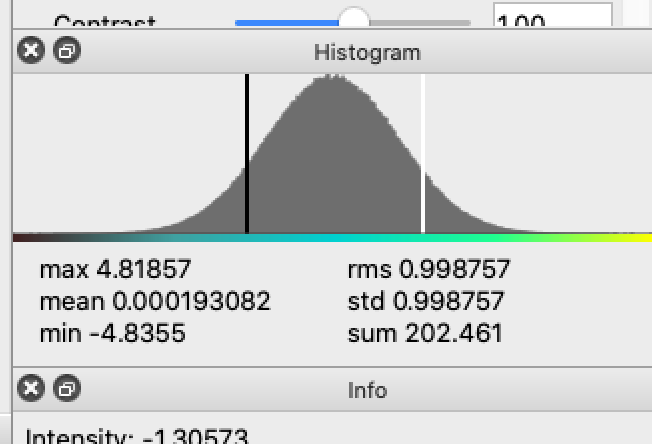

You can zoom into a certain part of the data by clicking and dragging on a range in the histogram. Under the histogram is a list of various information about the data set such as the maximum value, mean value, and minimum values.

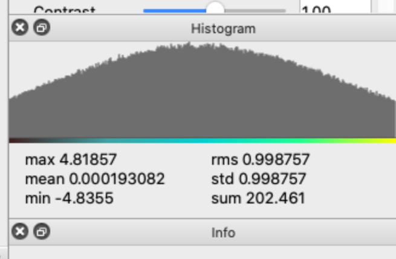

Data and Display
================
Now that we know about the workspace and some utility panels, we can go into some other things Nion Swift can do.

Data Processing
---------------
First, we will learn how to apply processing to data. For the tutorial, we will apply a gaussian blur to the generated data. To do this, select the generated data and use the [Processing > Filter > Gaussian Filter] menu item. This will create a new data item and will automatically display the processed data.

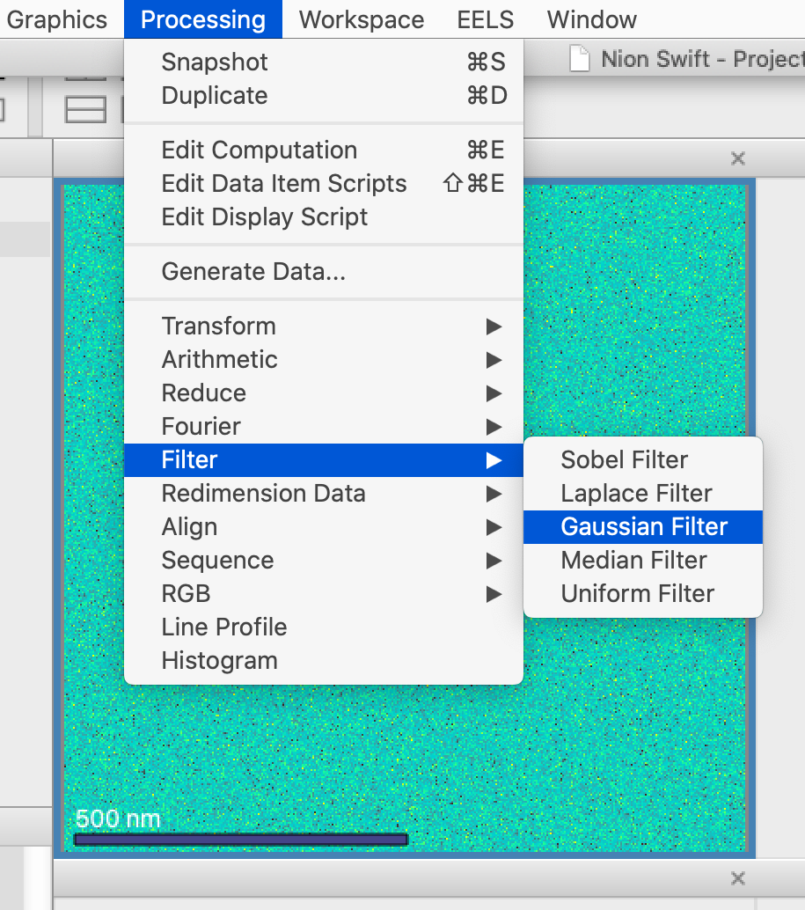

You can change parameters for processing in the Computation panel and see the changes updated in real time. For example, the gaussian width can be changed and the data will update live. To do this, open the Computation panel either by using the menu item [Processing > Edit Computation] or by using the shortcut [Ctrl + E] (or [Cmd + E] on macOS).

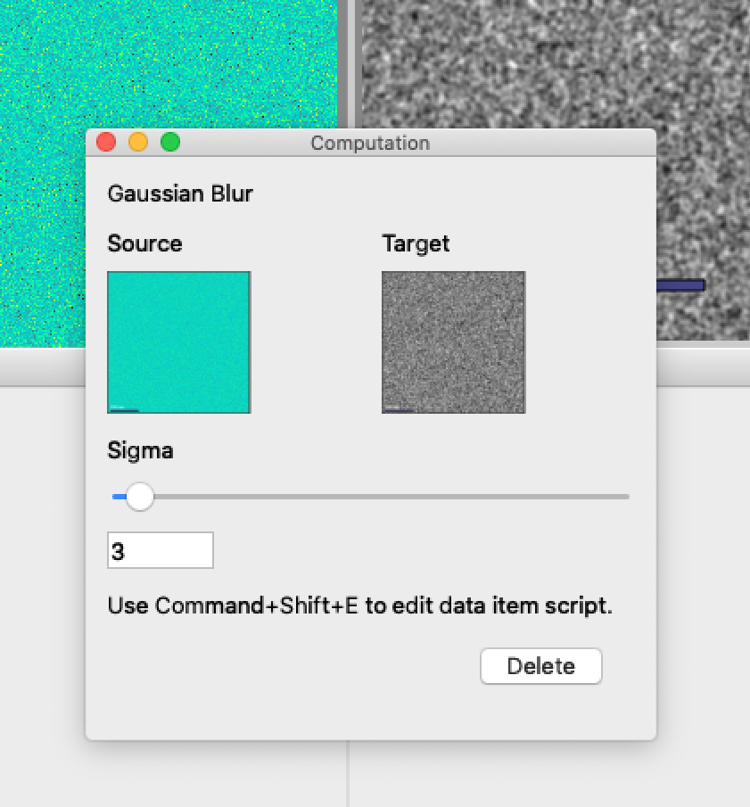

Graphics
--------
To add graphics to data, you can use the [Graphics] menu item. You can also use keyboard shortcuts to add graphics on the selected display panel. For example, the lowercase 'N' key will bring up the line tool and the lowercase 'C' key will bring up the rectangle tool. Use the C key or the [Graphics > Add Rectangle Graphic] menu item to add a rectangle to the image.

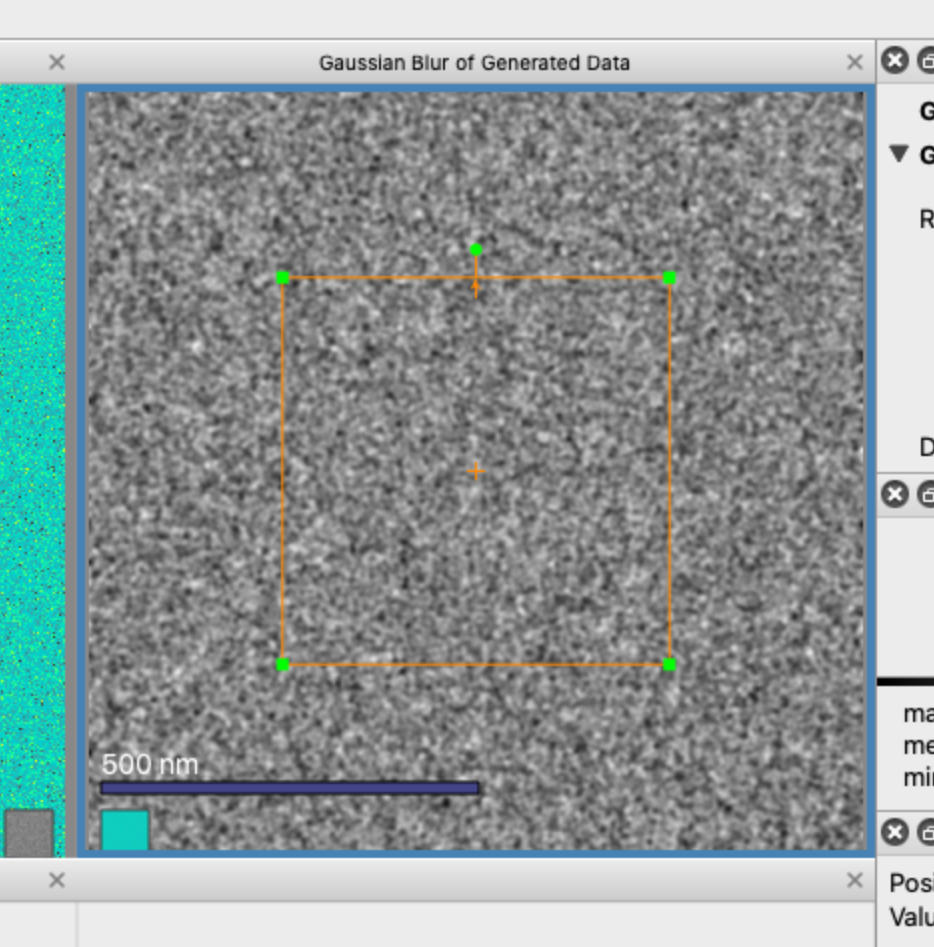

Line Profiles
-------------
We can also add a line profile to the display that will generate a new line plot in another display panel. You can do this by either using the menu item [Processing > Line Profile] or by selecting a display panel and pressing the lowercase 'L' key.

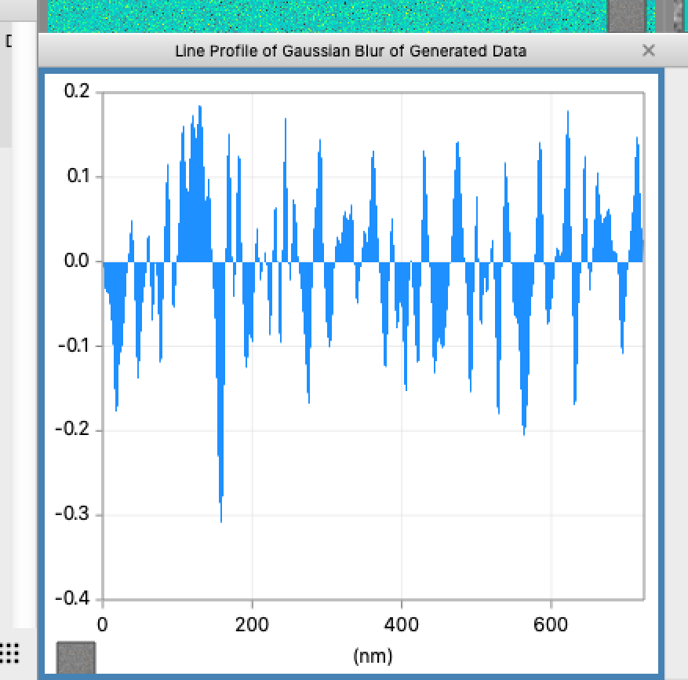

Try adding an interval graphic to the line plot by using the [Graphics > Add Interval Graphic] or by clicking and dragging to select a range on the line plot itself. Once an interval is created, hit Enter to zoom into that range.

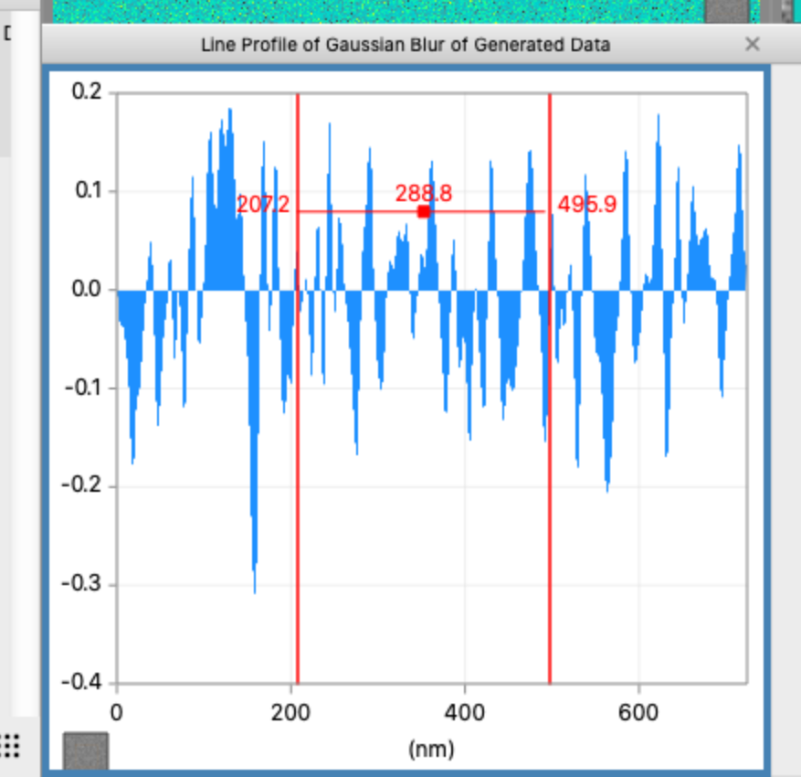

You can change the axes of the line plot from the Calibrations subsection of the inspector panel or by dragging the axes. To reset the axes, double click on each axis in the display panel.

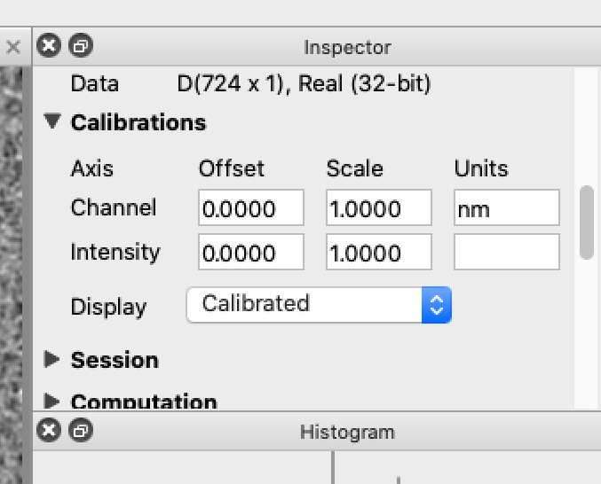

Browser Display Panels
----------------------
Now there are several displayed images to keep track of. To make it easier to see them in context with each other, we can create a browser display panel. A thumbnail browser shows all displayed data and allows you to change which one is highlighted. To use a display panel as a thumbnail browser, select an empty display panel and then use the menu item [Display > Thumbnail Browser] or pressing the lowercase 'V' key while a display panel has keyboard focus. By selecting the thumbnail browser, we can flip between the displayed images in the same panel using the arrow keys.

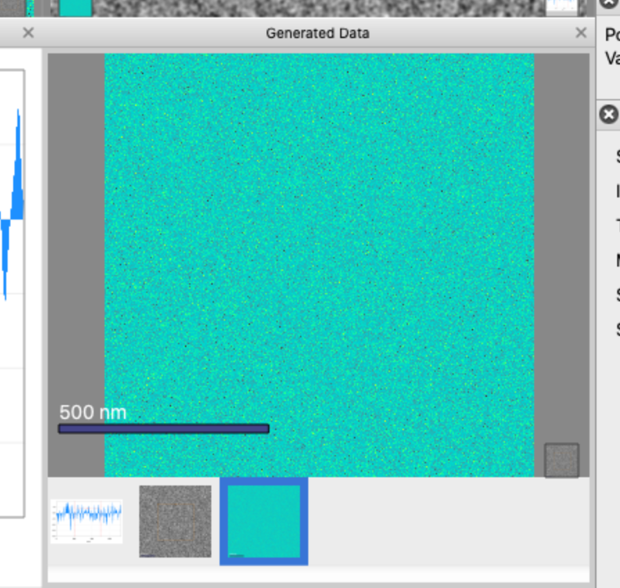

Alternatively, you can use a display panel as a grid browser by selecting the display panel and using the menu item [Display > Grid Browser]. A grid browser shows all of the displayed images side by side in the same panel. To delete the contents of a display panel, select the display panel, control click or right click on it, and select the menu item [Clear Display Panel Contents]. 

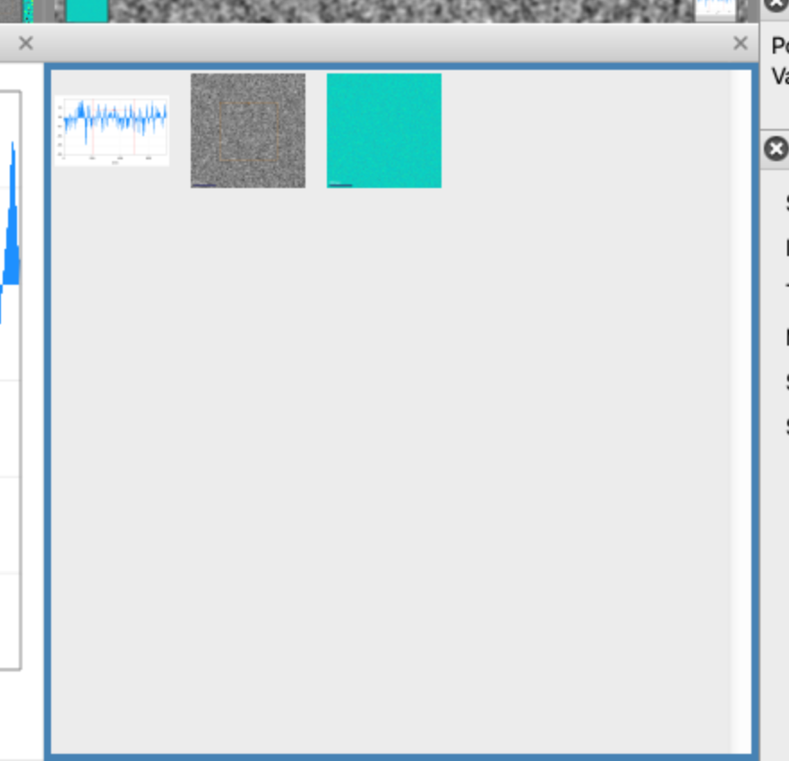

Importing and Exporting
=======================
Nion Swift supports many file types for importing and exporting. The most common types for importing data are TIFF and DM3 files.. To import data, drag the file or files into the workspace or use File > Import.

There are several options to export the data that we have been working with. The images in the display panels can be exported as GIF, JPEG, and PNG formats while the raw data items can be exported into TIFF and DM3 files. Data sets like the line plot can also be exported as a CSV file. Export data by using the [File > Export…] menu item.

**********
Next Steps
**********
You are now ready to start your own project and use your own data! In this tutorial you have learned how the window is set up and where to find everything you need for processing your own data. You learned how to create a new project, set up your window, utilize the functions of several utility panels, add graphics, perform processing functions, and export your data once you are done. You know how to manage data items in the data panel, how to transfer them to display panels, and how to adjust the displays to get them exactly how you need them.

If you are unsure about any step of the process, you can come back to this tutorial or view the full :ref:`user-guide` for more in-depth explanations of the software.
