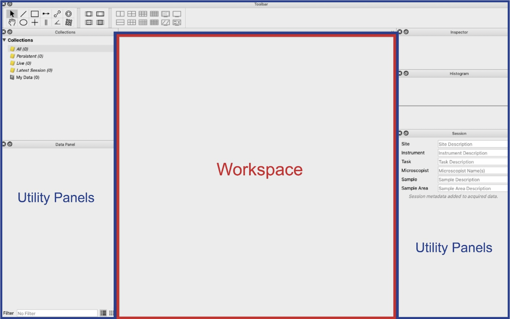
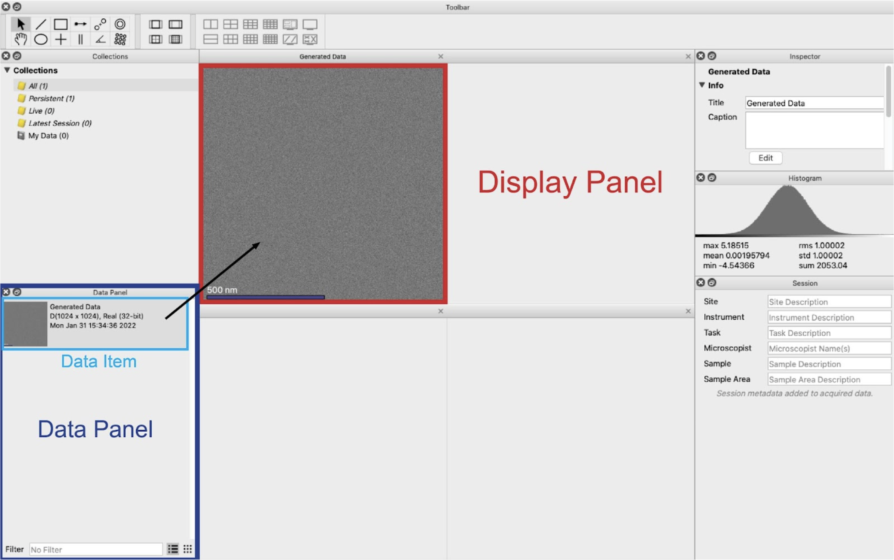
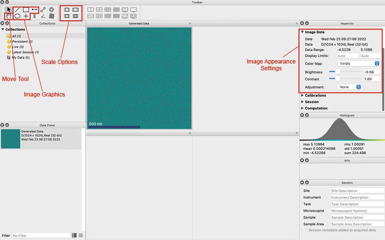
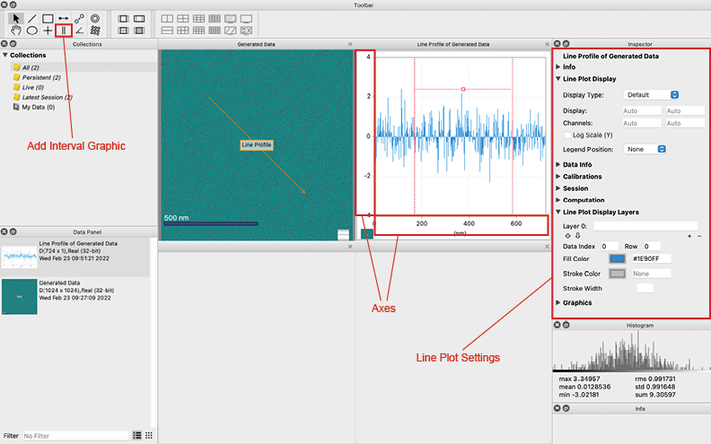
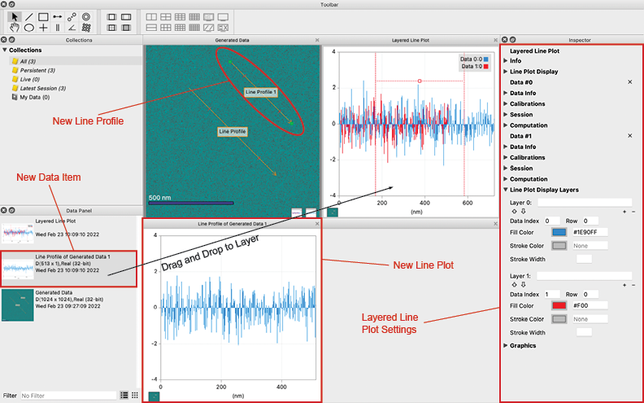
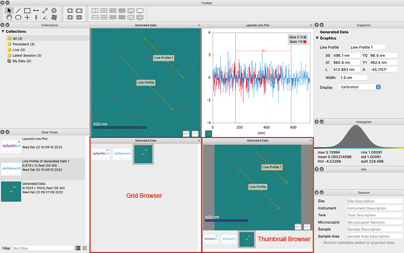

:orphan:

.. _display-panels:

**************
Display Panels
**************
The center of the window is called the workspace and it is where data is visualized. The workspace consists of display panels which display a piece of data (also called a data item). 

In a new project, the workspace will be filled by a single display panel. Use the toolbar to split the workspace into multiple smaller display panels, zoom into images, add graphics, and move an image.

To display a data item, drag it from the data panel into a display panel. You can also drag data files into a display panel directly from your desktop and from Explorer on Windows or Finder on macOS. Many utility panels operate only on the selected display panel(s). With a data item in a selected display panel, you can use the utility panels surrounding the workspace to process, analyze, and edit the datails of the displayed data.

Data can be displayed as 2D images or 1D line plots. Higher-dimensional data can be displayed as sets or lists of 2D images or as lists of 1D spectra. You can also use a display panel as a browser to help compare or manage your data.

.. _Image Display Panel:

Images
======
An image is the visualization of 2D data in a display panel. There are several ways to adjust the view of an image.

**Moving Images**

Move an image by selecting the move tool from the toolbar and then clicking and dragging on the image. If you are using a trackpad, you can also move the image by dragging with two fingers while the cursor is hovering over the image.

**Scaling Images**

Scale images by selecting one of the scale options from the toolbar or zoom in and out of an image by using the + and - keys. A data item will be set to fit to the enclosed space by default when it is first displayed. With the toolbar buttons, you can choose to have the image fit to the display panel, fill the display panel, scale to a 1:1 ratio of image pixels to screen pixels, or scale to a 2:1 ratio of image pixels to screen pixels. If the scale is set to fit or fill the display panel, the image will rescale with the display panel if it is resized. If the scale is set to either the 1:1 or 2:1 ratios, the image will not scale with the display panel. Scaling of a selected image can also be performed by using the Display menu and selecting Fit to View, Fill View, 1:1 View, or 1:2 View.

**Changing Colors, Contrast, and Brightness**

Change the set of colors an image uses by choosing a color map in the Image Data subsection of the Inspector panel. Here, you can also change the contrast and brightness of the image.

**Adding Image Graphics**

Add image graphics to an image by using either the toolbar or the [Graphics] menu. The line, ellipse, rectangle, and point graphics are image graphics. See Image Graphics

**Adding Line Profiles**

Add a line profile to an image with the line profile tool in the toolbar or by hitting the lowercase “L” key. See COMPUTATIONS

.. _Line Plot Display Panel:

Line Plots
==========
A line plot is the visualization of 1D data in a display panel. Changing several parameters allows you to see the data exactly the way you want.

**Adjusting Data**

Move the data along an axis of a line plot by clicking and dragging on either the left or bottom axis.

**Zooming on Axes**

Zoom in or out on an axis by using [Ctrl + Click] (or [Cmd+Click] for macOS) and dragging along the axis. Zoom in on the left axis by dragging upward and out by dragging downward. Similarly, Zoom in on the bottom axis by dragging right and out by dragging left.

**Resetting Axes**

Reset the axes, by double clicking on each axis. By default, the axes of a line plot will scale automatically.

**Using a Log Scale Y Axis**

Set the Y axis of a line plot to a logarithmic scale by checking the “Log Scale (Y)” checkbox in the Line Plot Display subsection of the Inspector panel.

**Switching Coordinate Systems**

Choose to display calibrated or uncalibrated values in the Calibrations subsection of the Inspector panel. By default, a line plot will display calibrated values. You can manually change the calibration in the Inspector panel, but if the line plot data is the result of a computation or acquisition, then the calibrations will be reset if the data is recalculated or reacquired.

**Changing Colors, Contrast, and Brightness**

Change the fill color, stroke color, and stroke weight of a line plot in the Line Plot Display Layers subsection of the Inspector panel.

**Adding Line Plot Graphics**

Add line plot graphics to a line plot by using either the toolbar or the [Graphics] menu. The channel and interval graphics are line plot graphics. See :ref:`line plot graphics`.
  
.. _Line Plot Layers:

Line Plot Layers
----------------
Line plots can be layered to show multiple data items on the same plot. To layer line plots, drag a line plot data item from the data panel onto the graph portion of a displayed line plot. Do not drop the data item onto the sides of the display panel or the data item will replace the line plot in the display panel. Line plots can only be layered if the calibrated units match those of the first data item.

**Changing the Color of Layers**

Each layer of a line plot will have a unique fill color by default. To change the fill color, stroke color, and stroke width of each layer, use the Line Plot Display Layers subsection of the Inspector panel. Clicking on the color box next to Fill Color or Stroke Color will open the color selection window. To input color at text, you can use RGB values such as rgb(100, 50, 200), hex values such as #55AAFF, or a web-defined color such as Blue. Change the transparency of a color by either inputting text with a transparency code like rgb(100, 50, 200, .5) or #55AAFF80, or by using the opacity sliders in the pop-up color selection panel.

**Ordering Layers**

The same subsection will allow you to scroll through setting options for each layer. Each layer will be differentiated by the Data Index. This is a number starting with 0 used to name each layer. Adding a new data item on top of a line plot will automatically create a new associated layer.

Reorder layers by clicking the up and down arrow buttons in the section of the Inspector panel associated with the layer you want to move. For example, to move layer 1 down, click the down arrow under "Data #0" in the inspector panel. 

A legend will appear on a line plot with multiple layers. Change the position of the legend or toggle its visibility with the Legend Position drop-down in the Line Plot Display subsection of the inspector panel. You can also reorder layers directly from the legend by clicking and dragging on the layer names in the legend.

**Adding and Removing Data or Layers**

Data items can be removed from the layered line plot entirely by clicking the X in the inspector panel next to the title of the data item you want to remove. The data items will be labeled Data #0, Data #1, etc. If a data item is deleted from the layered line plot, all associated layers will also be removed.

If a data item added to a line plot has multiple rows of data, you can choose in the Line Plot Display Layers subsection of the inspector which row to show. Data items that are higher dimensional, a 2D image for example, cannot be layered onto a line plot.

To add or remove layers to a data item that is already layered in the line plot, click the + or - buttons in the data item's subsection of the inspector panel.

.. _Display Panel Browsers:

Browsers
========
To use a display panel as a browser, use the menu item [Display > Thumbnail Browser] or [Display > Grid Browser] or hit the lowercase “V” key while a display panel is selected to switch between the display, the thumbnail browser, and the grid browser.

A thumbnail browser shows a large image of the selected item but also shows thumbnail images of the other items. Click on a thumbnail image or use the left and right arrow keys to quickly switch between images.

A grid browser shows all the data items in the project in a grid. You can use this to quickly select data items even if they are not displayed or if there are a lot of items to scroll through in the data panel. You can also use all four arrow keys to navigate the grid browser selection.
