:orphan:

.. _graphics:

Graphics
========
Graphics mark and annotate regions in displays. They serve two roles: functional, where they designate a region for processing (such as a crop or line profile); and annotation, where they visually mark data for reference. Some graphics work with images, others with line plots.

Fourier graphics define filter regions that are applied when filtering Fourier data.

Graphics can be labeled using the inspector; the label appears next to the graphic on screen.

Most graphics can be added from menus or the Tool Bar (see :ref:`Tool Panel`).

To select a graphic, click on it.

To deselect all graphics, click outside them.

To edit selected graphics, select one or more graphics on the same display item and use the :ref:`graphics inspector section` subsection of the :guilabel:`Inspector` panel.

Selecting a display panel with graphics shows parameters for all applied graphics in the :guilabel:`Inspector` panel.

Some graphics support position, shape, and rotation locks in the :guilabel:`Inspector` panel. When a lock is enabled, dragging that part has no effect.

To copy graphics, select them with :kbd:`Ctrl` + click (or :kbd:`Command` + click on macOS), then use :kbd:`Ctrl+C` (or :kbd:`Command+C` on macOS).

To cut graphics, select them and use :kbd:`Ctrl+X` (or :kbd:`Command+X` on macOS).

To paste graphics, use :kbd:`Ctrl+V` (or :kbd:`Command+V` on macOS).

To delete graphics, select them and press :kbd:`Delete` or use :menuselection:`Edit --> Delete`.

To select a graphic behind another, click its control points directly — control points take priority over the body of graphics in front.

To cycle through graphics on a display in the order they were added, press :kbd:`Tab`.

To cycle through graphics in reverse order, press :kbd:`Shift` + :kbd:`Tab`.

.. _Image Graphics:

Image Graphics
--------------
Image graphics can only be placed on 2D image displays. Add one using the graphic buttons in the Tool Bar or the :menuselection:`Graphics` menu.

.. _Line Graphic:

Line Graphic
++++++++++++
The line graphic draws a line between two anchor points.

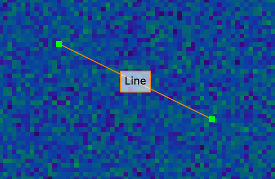

To move the line, click and drag anywhere along it (not on an anchor point).

To adjust an endpoint, drag an anchor point.

To resize symmetrically about the line midpoint, hold :kbd:`Alt` (or :kbd:`Option` on macOS) while dragging an anchor point.

To snap to multiples of 45°, hold :kbd:`Shift` while dragging an anchor point.

In the :guilabel:`Inspector` panel, you can adjust the length, angle, and (x,y) coordinates of both anchor points.

.. _Ellipse Graphic:

Ellipse Graphic
+++++++++++++++
The ellipse graphic draws an ellipse defined by four anchor points.

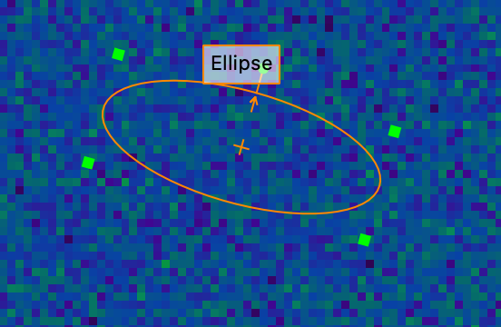

To resize the ellipse about its center, drag an anchor point.

To resize with the opposite corner fixed, hold :kbd:`Alt` (or :kbd:`Option` on macOS) while dragging an anchor point.

To constrain the ellipse to a circle, hold :kbd:`Shift` while dragging an anchor point.

To rotate the ellipse, drag the fifth, exterior anchor point.

To snap to 45° intervals when rotating, hold :kbd:`Shift`.

To move the ellipse, click and drag from inside it.

In the :guilabel:`Inspector` panel, you can adjust the center point, height, width, and rotation.

.. _Rectangle Graphic:

Rectangle Graphic
+++++++++++++++++
The rectangle graphic draws a rectangle with anchor points at the vertices.

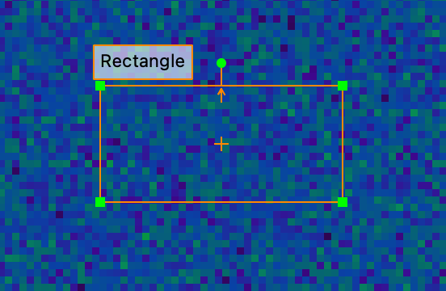

To resize the rectangle with the opposite corner fixed, drag a corner.

To resize about the rectangle center, hold :kbd:`Alt` (or :kbd:`Option` on macOS) while dragging a corner.

To constrain the rectangle to a square, hold :kbd:`Shift` while dragging a corner.

To rotate the rectangle, drag the fifth, exterior anchor point.

To snap to 45° intervals when rotating, hold :kbd:`Shift`.

To move the rectangle, click and drag from inside it.

In the :guilabel:`Inspector` panel, you can adjust the center point, height, width, and rotation.

.. _Point Graphic:

Point Graphic
+++++++++++++
The point graphic marks a single position with four surrounding anchor points.

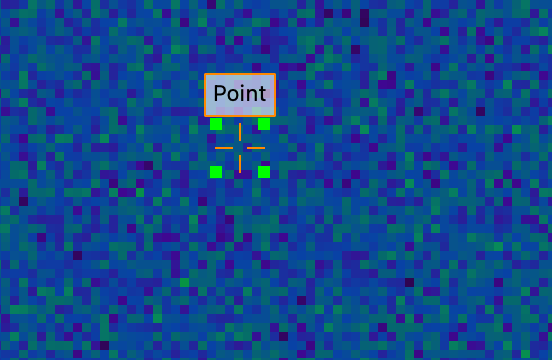

The anchor points indicate the graphic boundary and cannot be moved independently. Click and drag from inside the anchor points to move the graphic.

In the :guilabel:`Inspector` panel, you can adjust the (x,y) position.

.. _Line Plot Graphics:

Line Plot Graphics
------------------
Line plot graphics can only be placed on 1D line plot displays. Add one using the graphic buttons in the Tool Bar or the :menuselection:`Graphics` menu.

.. _Interval Graphic:

Interval Graphic
++++++++++++++++
The interval graphic marks a range between two boundary positions on a line plot.

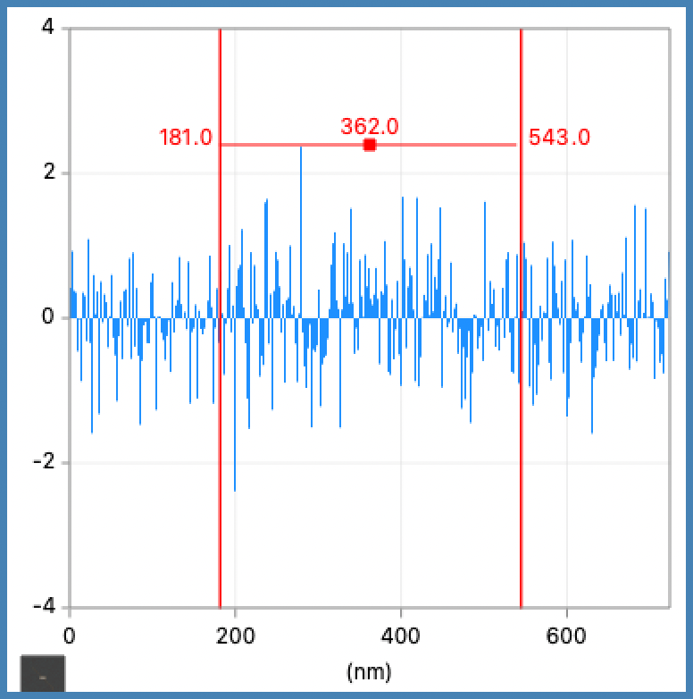

To adjust a boundary, drag it.

To move the entire interval, drag the center anchor point.

In the :guilabel:`Inspector` panel, you can adjust the channel values of each boundary.

If another interval graphic blocks creation of a new one, use the :guilabel:`Interval Graphic` button in the Tool Bar to force a new graphic. This can happen when selection resolves to an existing interval instead of creating another overlapping one.

When selected, the interval shows its left channel, right channel, and width values.

To move the interval by dragging a boundary instead of editing that boundary, hold :kbd:`Ctrl` (Windows) or :kbd:`Command` (macOS) while dragging.

.. _Channel Graphic:

Channel Graphic
+++++++++++++++
The channel graphic marks a single position along the x axis with an orange marker.

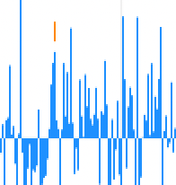

To reposition the marker, drag the orange marker.

In the :guilabel:`Inspector` panel, you can adjust the channel position.

Processing Graphics
-------------------

Processing graphics are linked to a computation and automatically produce an output data item — editing the graphic updates the result in real time.

.. _Line Profile Graphic:

Line Profile
++++++++++++
The line profile graphic defines a line used to sample data along its length, producing a new 1D data item from the image beneath the line.

Add a line profile using the :guilabel:`Line Profile` tool in the Tool Bar, or from the menu :menuselection:`Processing --> Line Profile`.

In the :guilabel:`Inspector` panel, you can edit the start, end, length, angle, and width.

To adjust an endpoint, drag it.

To resize symmetrically about the line midpoint, hold :kbd:`Alt` (or :kbd:`Option` on macOS) while dragging an endpoint.

To constrain adjustments to horizontal, vertical, or 45°, hold :kbd:`Shift` while dragging.

To reposition the line, drag the middle of it.

To constrain movement to horizontal or vertical, hold :kbd:`Shift` while dragging.

Press :kbd:`+` or :kbd:`=` to increase the line width, or :kbd:`-` to decrease it.

See :ref:`Line Profile Computation`.

.. _Cropping:

Using a Rectangle or an Interval as a Crop
------------------------------------------
A rectangle graphic on an image or an interval graphic on a line plot can be used as a crop to define a region of interest for processing.

To add a computation with a crop, select the graphic and choose the desired computation from the :menuselection:`Processing` menu. The computation uses the selected graphic as a crop region.

.. _Masking:

Using Graphics as Masks
-----------------------
Graphics that cover an area on images or an interval on line plots can be used as masks to define a region of interest for processing.

Masks apply to any data, including non-Fourier data.

Masks are per display item, because graphics are attached to individual displays.

To use a graphic as a mask, select it and choose :menuselection:`Graphics --> Add to Mask`. The graphic turns blue to indicate that it is part of the active mask region.

To remove a graphic from the mask, select it and choose :menuselection:`Graphics --> Remove from Mask`.

.. _Fourier Filtering:
.. _Fourier Filtering Graphics:

Fourier Filtering Graphics
--------------------------
Fourier filtering graphics define filter regions on complex-valued image data. They let you isolate and process a specific region of Fourier space — for example, to remove or preserve particular frequencies or angles — rather than operating on the full image. Add them using the graphic tools in the Tool Bar or the :menuselection:`Graphics` menu.

Because Fourier-space data is symmetric around an origin defined by the data calibration, Fourier filtering graphics are symmetric around that origin and provide intuitive control of frequency and angle regions.

For Fourier-space images, the origin is at the center of the image.

Diffractograms, which are captured from real-world cameras rather than computed, are not marked as Fourier-space internally and may have an off-center origin. Adjust the calibrations to set the origin for filtering.

Fourier filtering graphics are also used by :menuselection:`Processing --> Arithmetic --> Mask` and :menuselection:`Processing --> Arithmetic --> Masked`.

To add a regular image graphic to the active filter region, select it and choose :menuselection:`Graphics --> Add to Mask`.

To remove a regular image graphic from the active filter region, select it and choose :menuselection:`Graphics --> Remove from Mask`.

A graphic turns blue when it is part of the active filter region.

Apply Fourier filtering using :menuselection:`Processing --> Fourier --> Fourier Filter`.

A pixel is considered within the filter region if its center falls within any Fourier filtering graphic.

Multiple Fourier filtering graphics combine as a union of their selected regions.

Four preset Fourier filtering graphics are available: :ref:`Spot Graphic`, :ref:`Angular Graphic`, :ref:`Band-Pass Graphic`, and :ref:`Lattice Graphic`.

For more information about adjusting parameters, see the :ref:`graphics inspector section` subsection of the :guilabel:`Inspector` panel.

.. _Lattice Graphic:

Lattice Graphic
+++++++++++++++
The lattice graphic defines a repeating grid of circles across the image for filtering regularly spaced frequencies in Fourier space.

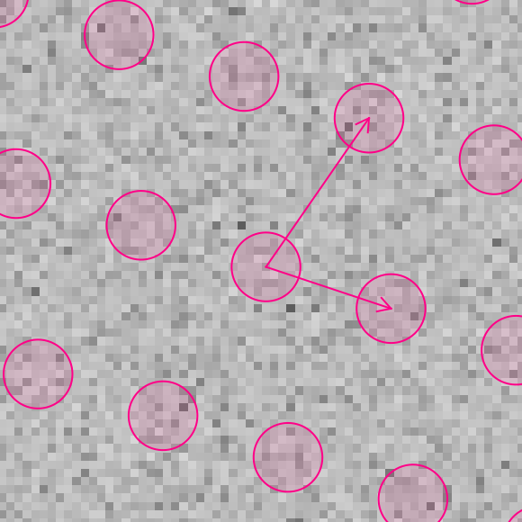

Two movable circles (shown with green anchor points) define the grid pattern, one inside the image and one outside.

If one circle is outside the visible image area, press :kbd:`-` to zoom out to see both.

.. _Band-Pass Graphic:

Band-Pass Graphic
+++++++++++++++++
The band-pass graphic creates a ring-shaped filter region centered on the Fourier origin.

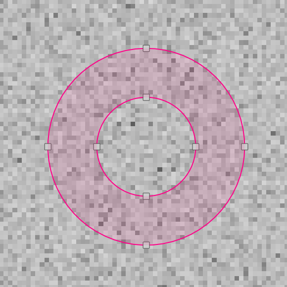

The ring can include the area inside the ring (low-pass), exclude it (high-pass), or select just a band between two radii (band-pass).

To adjust the radii, drag the anchor points along the image edges.

In the :guilabel:`Inspector` panel, you can adjust both radii and the filter mode. Radius 1 is the outermost radius. Low-pass excludes frequencies outside the ring; high-pass includes only those outside; band-pass selects the region between the two radii.

.. _Spot Graphic:

Spot Graphic
++++++++++++
The spot graphic creates a pair of identical, symmetrically placed ellipses for filtering a specific frequency at a specific angle.

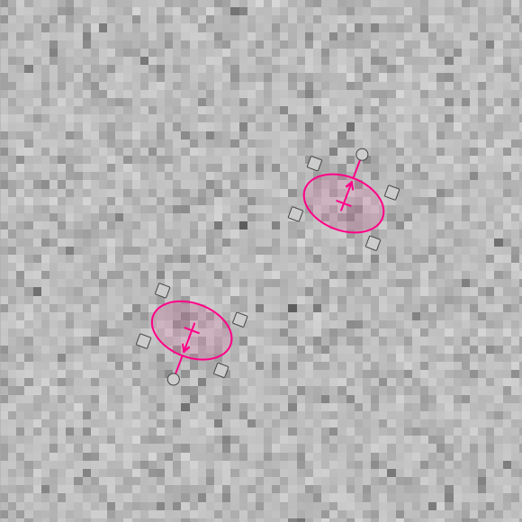

The two ellipses are always identical and placed symmetrically around the Fourier origin.

Manipulating one ellipse automatically updates the other.

If one ellipse is outside the visible image area, press :kbd:`-` to zoom out.

The ellipses behave like a regular :ref:`Ellipse Graphic`.

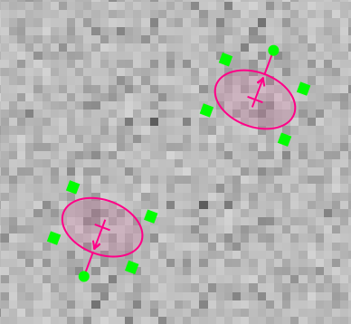

In the :guilabel:`Inspector` panel, you can adjust the center position and rotation of the ellipse inside the image.

.. _Angular Graphic:

Angular Graphic
+++++++++++++++
The angular graphic defines a wedge-shaped filter region radiating from the Fourier origin, for filtering a range of frequencies at a specific angle.

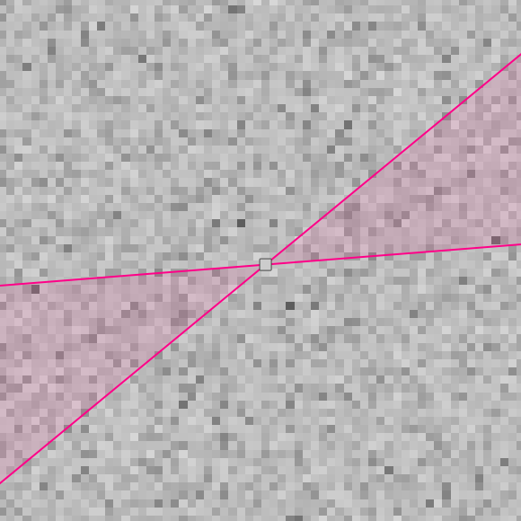

To move the wedge, click and drag within the highlighted region.

To adjust the angle range, drag either boundary line.

In the :guilabel:`Inspector` panel, you can adjust the starting and ending angles.
