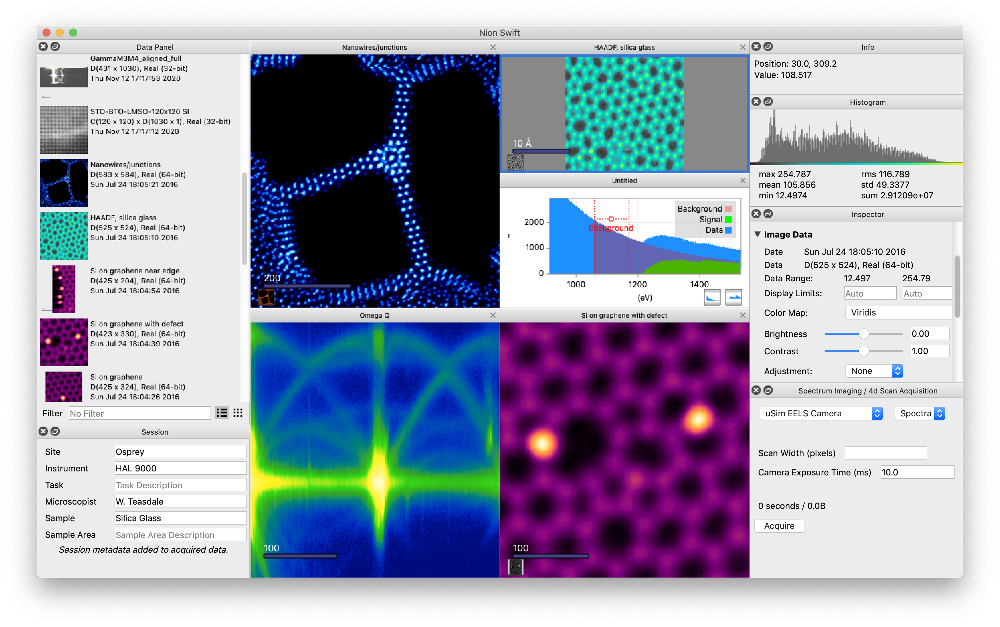

.. include:: defs.rst
.. _index:

|AppName| User's Guide (16.11.0)
================================
|AppName| is an open-source scientific image-processing software that uses Python to integrate hardware control, data acquisition, visualization, processing, and analysis. It runs on Windows, Linux, and macOS.

|AppName| is designed to be an intuitive and user-friendly platform, making the acquisition of scientific data from a range of microscopes and instruments a straightforward process. Its sophisticated data visualization, processing, and analysis capabilities further enhance your confidence in handling complex scientific data.

Key Features

- Handles various data, including images, line plots, and higher dimensional data.
- Live computations applied during acquisition or used for parameter adjustment.
- Low latency, high throughput data acquisition platform.
- Customization via scripting and plug-ins using Python.
- Open source, cross-platform (macOS, Windows, Linux), and Python-based scientific data processing.

Who Uses |AppName|?
-------------------

|AppName| has been primarily developed for the operation of Nion electron microscopes and also as an offline tool to visualize, process, and analyze scientific data from electron microscopes, other instrumentation, and other scientific fields.

|AppName| is open source. You can find the source code on
`GitHub |AppName| <https://github.com/nion-software/nionswift/>`_.

Installation/Upgrading
----------------------
The quickest and easiest way to get |AppName| running is to download a pre-built version that includes everything needed to run the basic application.

* `Download for macOS, Linux, or Windows <https://nion.com/swift/downloads>`_.

To install |AppName| from Python source code, you will need to install a Python environment and then install Python packages required for |AppName|.

For specific installation details and download links, follow link below. Instructions to install additional packages to extend |AppName| are also covered.

* :ref:`installation`
* :ref:`upgrading`

Release Notes
-------------
To see a list of changes for each version of |AppName|, follow the link below.

* :ref:`release-notes`

Using |AppName|
---------------
Once you have installed |AppName| and successfully launched it, you can read the introduction to understand the basic ideas, follow through the basic tutorial to try out key concepts, and consult the user guide for more advanced use, Python scripting, and reference.

* :ref:`basic-use`
* :ref:`user-guide`

.. _python-scripting:

Python Scripting
----------------
|AppName| offers a great deal of functionality using the user interface. However, sometimes you will want to go beyond its intrinsic capabilities. Fortunately it is easy to extend the functionality using Python.

* :ref:`scripting`

|AppName| Links
---------------
`|AppName| Google Group <https://groups.google.com/forum/#!forum/nionswift>`_ News and Announcements.

Indices and Tables
==================

Links
-----
* :ref:`genindex`
* :ref:`modindex`
* :ref:`search`

..
  Docs environment:
  conda create -n docs pip sphinx scipy h5py imageio pytz tzlocal pillow
