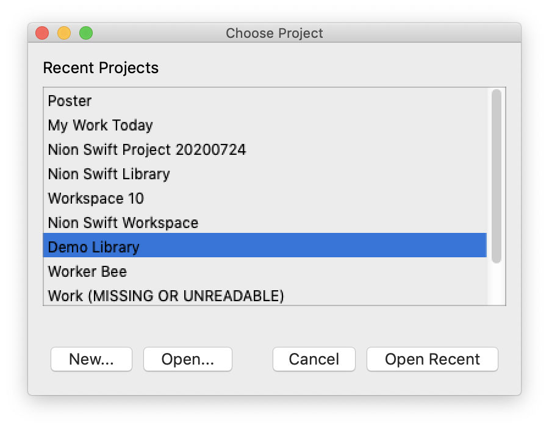

:orphan:

.. _upgrading:

Upgrading from Earlier Versions
===============================

Notable Changes
---------------
The highlights of this release are improved display performance, improved reliability, improved line plot displays, and an improved computation inspector.

In addition, the nomenclature has changed slightly. In Nion Swift 15, data is stored in *Projects*. Projects were previously named *Libraries*. This change was made to conform more to image processing and archiving standard terms.

The menus have also changed slightly. The *View* menu has been split into *Display* and *Workspace* menus. And a new menu *Graphics* has been added.

Upgrading
---------
Be sure to quit/exit any previous versions of Nion Swift before running the new version.

If you had been using an earlier version of Nion Swift, your existing projects will be scanned when you launch the first time. This may take a while depending on how many existing projects are available.

When you open a project created in an older version of Nion Swift, the project may need to be upgraded. Depending on what version of Nion Swift originally created the project, you may be asked to choose a new location. In other cases, the new location will be automatically determined to be in the same enclosing folder of the previous project.

When Nion Swift upgrades a project, it copies all of the data from the previous project to the new project. The old data will be left unmodified. You must have disk space available for the extra copy of the data or the procedure will fail. In this case, you can safely delete the failed copy (see below) and try again once disk space is available.

The upgraded project index will be available with a new file extension ".nsproj" and the new project data will be available in a folder next to the new project ".nsproj" file but with " Data" appended.

So if your old project was in a directory named "Graphene Experiment", there will be a file named something like "Nion Swift Library 13.nslib" within that folder; and another sub-folder named "Nion Swift Data 13". Once the project has been updated, there will a new file name "Graphene Experiment.nsproj" at the same level that the old project "Graphene Experiment" existed; and another directory name "Graphene Experiment Data" with the data. You can safely move the old directory "Graphene Experiment" to an archive.

Old project files/folders::

    C:\Data\Graphene Experiment\Nion Swift Library 13.nslib
    C:\Data\Graphene Experiment\Nion Swift Data 13

New project files/folders::

    C:\Data\Graphene Experiment.nsproj
    C:\Data\Graphene Experiment Data

Once the upgrade succeeds, we recommend that you confirm the new project location and then archive the old project files/folders. This prevents you from accidentally updating both the old and new projects (with an old version of Nion Swift) and generating conflicts that are difficult to merge.

Once the existing projects have been scanned and upgraded, Nion Swift will launch and ask you to choose an initial project. You can switch projects any time using the **File** > **Chose Project...** menu item.

