:orphan:

.. _user-interface:

**************
Utility Panels
**************

.. _Workspaces:
.. This section will be covered by the overview section so this will remain here temporarily until that section is finished.

Workspaces
==========
The workspace is the area where you can view your data.

The workspace can be subdivided into display panels and the size of the display panels can be adjusted by dragging on their edges.

You can drag external files into display panels to import them.

You can drag items from the data panel to the display panels to show them.

You can select one or more display panels for processing by clicking to select one or shift-clicking to select multiple.

If you do processing or acquisition which produces new data, its associated display item will be displayed in an empty display panel if available.

See :ref:`display-panels`.

Utility Panels
==============

Utility panels provide options for the selected item or items. There are various utility panels for editing different aspects of data.

The layout of the utility panels can also be moved around and adjusted. There are several ways to customize the utility panel layout:

* Show or hide any utility panel by using the [Window] menu.

* Close a utility panel by clicking the x button in the corner of its title bar.

* Rearrange the layout of the shown panels by clicking and dragging a utility panel by its title bar.

* Stack utility panels by dropping one utility panel onto another. If two or more panels are in a stack, selection buttons will appear at the bottom of the panel to switch between them.

* Expand utility panels into a separate window by dragging the panel by the title bar away from the main window.

* Resize a utility panel by clicking and dragging from its edges.

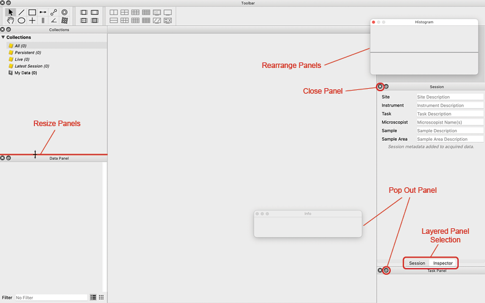

The utility panels are organized alphabetically in the [Window] menu and their functions are as follows:

.. _Activity Panel:

Activity
========
The Activity panel shows the activity of computations running in the background.

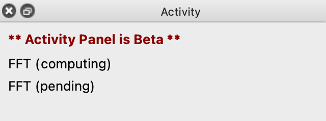

The activity panel displays changes to computations and updates during live data acquisition or editing. Activity will only be displayed if a computation is actively running. Otherwise, the panel will not show anything. 

Some computations are connected to a graphic. In this case, the activity panel will only display activity info while the graphic is being moved or manipulated. A computation like this is not always active.

.. _Collections Panel:

Collections
===========
The Collections panel sorts the data items in a project into folders. Data can also be sorted manually into a custom folder.

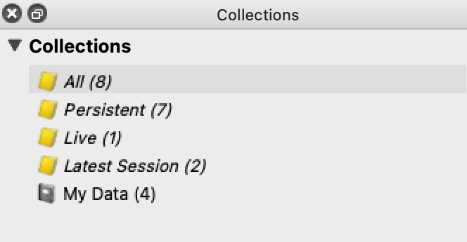

Data items are automatically sorted into four categories:

* :guilabel:`All` - All data items in the current project

* :guilabel:`Persistent` - Data items that are permenantly saved; these data items will not be overwritten by acquisition or recomputation without action by the user.

* :guilabel:`Live` - Data items that can be used for live acquisition and/or recomputation

* :guilabel:`Latest Session` - Data items used in the most recent session (since the most recent time the project was opened)

To view a collection, click on the title of the desired collection in the Collections panel. All data items in the collection will be listed in the Data panel. By default, the Data panel is set to show the “All” collection.

The Collections panel also provides a collection called :guilabel:`My Data` which is curated by the user. “My Data” can be used to group any data items together. To add a data item to the “My Data” collection, drag the data item from the data panel into the “My Data” collection in the Collections panel.

To add a new collection to the panel, use the menu item [File > Add Group]. Use this new folder just as the :guilabel:`My Data` folder above.

.. _Data Panel:

Data Panel
==========
The Data panel provides a list of the data items in a given collection. 

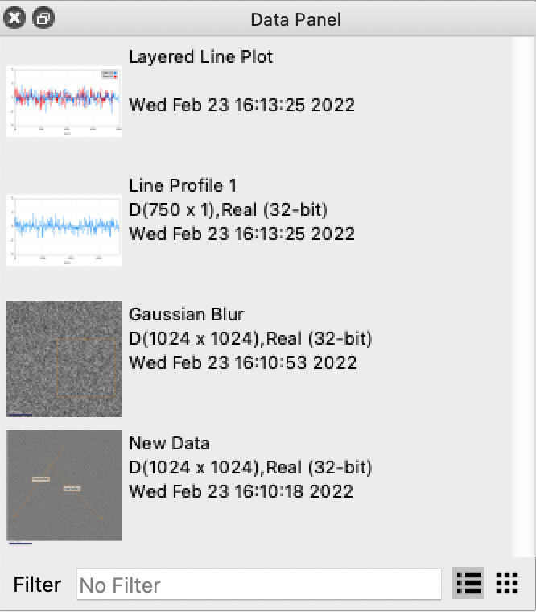

Any data item in the data panel can be displayed in a display panel. To display a data item, drag the data item from the data panel into an empty display panel.

By default, the Data panel is set to show all data items in a project, but the data panel can show any other collection by choosing a different collection in the Collections panel.

You can also search for data items in the selected collection by using the filter text box at the bottom of the Data panel. If a data item is not in the selected collection, it will not appear in the filtered results. The filter search bar looks for keywords in the titles and captions of data items.

Newly created data items will appear in the data panel. Make sure the collection is set to “All.” A new data item may not be applicable to the currently selected collection.

To delete a data item, select it in the data panel and press the delete key. To select multiple data items, hold down the control key (command key for macOS) and select all the data items you want to delete in the data panel.

.. _Histogram Panel:

Histogram
=========
The Histogram shows the frequency of different intensities in the selected data item.

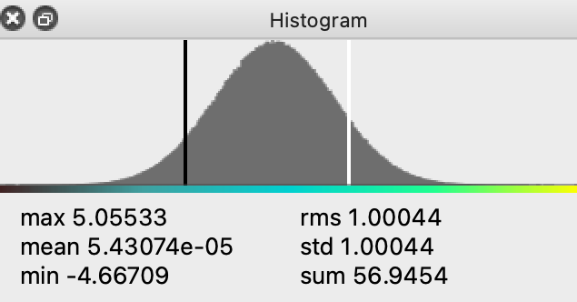

The bar directly under the histogram displays the color range of the data and will change color to match the color map of the selected display. General values about the data (maximum value, mean, minimum value, etc.) are displayed under the histogram. If no display panel or data item is selected, the histogram panel will not display anything.

To select a range of data, click and drag between two points on the histogram. Doing this will zoom into the histogram on the selected range and the associated display panel will only display data values within that range. To reset the range, double click on the histogram.

If a graphic is selected, the histogram will show data within that graphic. Click on a display panel outside the graphic to show the histogram for the full range of the data item.

.. _Info Panel:

Info
====
The Info panel shows the value of the data at the cursor's position. 

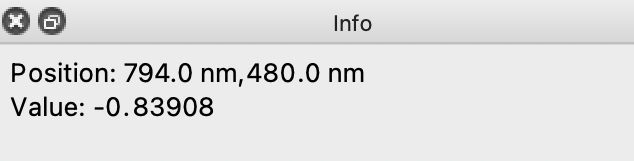

When hovering the cursor over the histogram, the info panel will show the intensity for a given position along the histogram.

.. _Inspector Panel:

Inspector
=========
The Inspector Panel shows information and settings for the selected item. The Inspector is split into subsections for specific functions. Clicking the triangle next to the title of a given subsection will expand or hide the subsection.

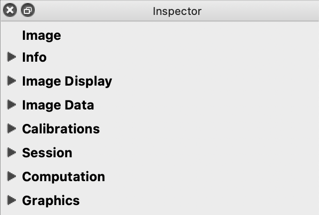

When different kinds of items are selected (display item, graphic, etc.) the Inspector's subsections will change to display settings relevant to the selected type of item. In the image above, an image is selected; and in the image below, a line plot is selected.

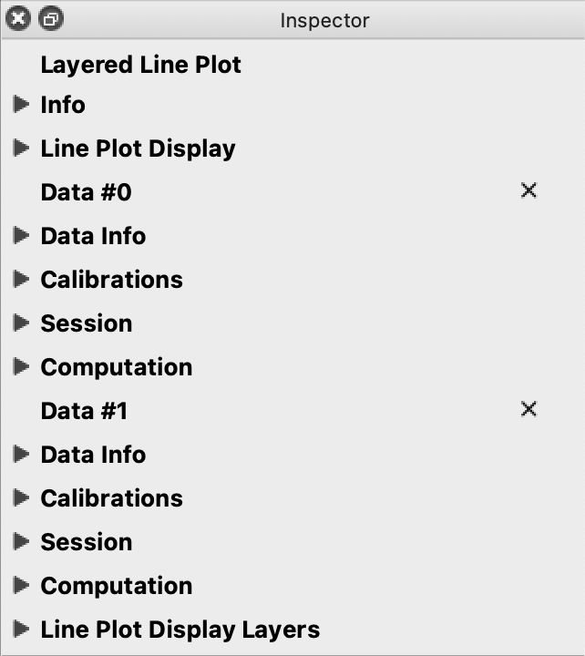

.. _Info Inspector Section:

Info
----
The Info subsection of the inspector allows you to edit the title and description of the selected item. 

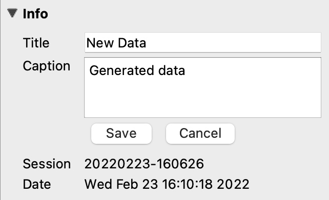

The Info subsection will only be visible if a single item is selected. If the item selected contains multiple data items, like a layered line plot for example, changing the title and description of the item will not affect the names and descriptions of each data item; it will change the title and description for the combined display item.

.. _Image Display Inspector Section:

Image Display
-------------
Image Display allows you to force an image to be displayed as a line plot instead of the default.

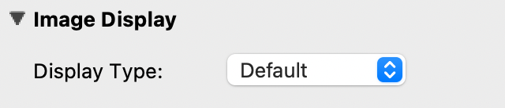

You can revert to the default display for an image by choosing :guilabel:`Default`.

.. _Image Data Inspector Section:

Image Data
----------
Image Data presents several controls and settings for a selected image:

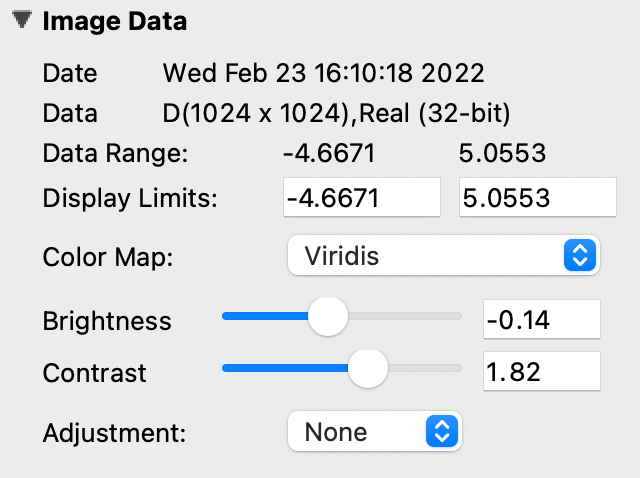

* :guilabel:`Date` - Displays the date and time the image was created.
  
* :guilabel:`Data` - Displays the dimensions of the image and the bit count.

* :guilabel:`Data Range` - Displays the minimum and maximum values of the selected data.
  
* :guilabel:`Display Limits` - Change the minimum and maximum values currently shown in the selected data. Editing these is the same as zooming in or out on an interval on the Histogram.
  
* :guilabel:`Color Map` - Change the color of the data. The data range is mapped to a range of colors. Choose from a list of preset color profiles. Grayscale is the default.
  
* :guilabel:`Brightness` - Change the brightness of the color values on the color map. Moving the slider to the right will increase the brightness and moving the slider to the left will decrease the brightness. 0.0 is the default brightness setting. The slider ranges from -1.0 to 1.0.
  
* :guilabel:`Contrast` - Change the range of color values on the color map. Moving the slider to the right will increase the contrast and moving the slider to the left will decrease the contrast. 1.0 is the default contrast setting. The slider ranges from 1/10 to 10.
  
* :guilabel:`Adjustment` - Change the equalization of the selected data. Choose between Equalized, Gamma, Log, or no adjustment.

* :guilabel:`Gamma` - If :guilabel:`Gamma` is selected for the adjustment, a new slider will appear to adjust gamma values. Moving the slider to the right will decrease the gamma and moving the slider to the left will increase the gamma. 1.0 is the default contrast setting. The slider ranges from 10 to 1/10.

.. _Line Plot Inspector Section:

Line Plot Display
-----------------
Line Plot Display presents several controls and settings for a selected line plot:

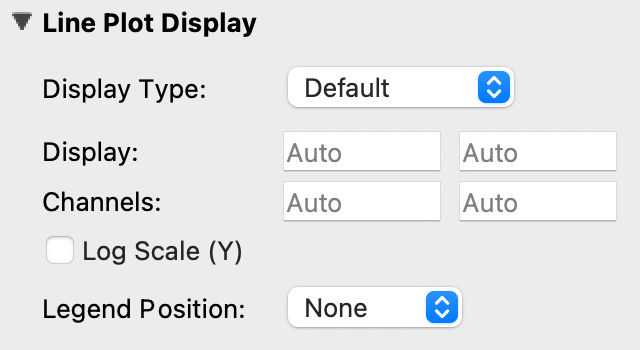

* :guilabel:`Display Type` - Force the selected line plot to display as an image.

* :guilabel:`Display` - Change the range of y values shown on the line plot. These values are set to automatically calculate by default, but changing them allows you to zoom into a specific section on the line plot.

* :guilabel:`Channels` - Change the range of x values shown on the line plot. These values are set to automatically calculate by default, but changing them allows you to zoom into a specific section on the line plot. Changing the channel values is similar to zooming into an interval on the line plot with an interval graphic.

* :guilabel:`Log Scale Y` - Set the y axis to scale logarithmically.

* :guilabel:`Legend Position` - Choose the position of the legend for a layered line plot. Line plots with no layers will not show a legend. 

.. _Data Info Inspector Section:

Data Info
---------
Data Info displays the date and time a selected line plot was created. It will also display the dimensions of the line plot and the bit count. 

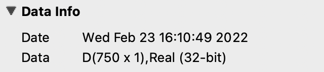

For line plots with multiple layers, each data item in the stack will have its own Data Info section. For more information, see :ref:`layers inspector section`.

.. _Calibrations Inspector Section:

Calibrations
------------
Calibrations allow you to make specific changes to the scale and position of a selected item. Images and line plot displays have different features in the calibrations subsection.

Image Calibrations
++++++++++++++++++
When an image is selected, the calibrations subsection of the inspector panel will show variables specific to an image.

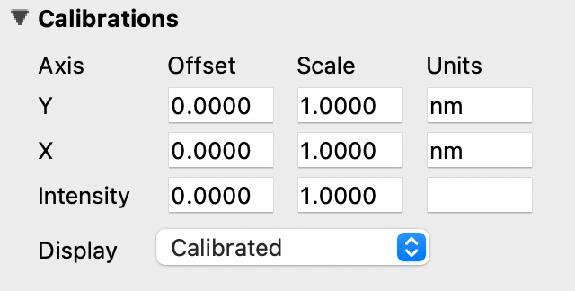

With an image selected, use the calibrations subsection to

* Change the offset, scale, and units on the y and x axes. The default units for images is nanometers (nm). The formula for the offset is x' = x * scale + offset.

* Change the intensity and scale of the selected image.

* Change the coordinate system. This will also change how the cursor position over a display item is shown in the Info panel. See :ref:`data-items` for more information.

Line Plot Calibrations
++++++++++++++++++++++
When a line plot is selected, the calibrations subsection of the inspector panel will show variables specific to a line plot.

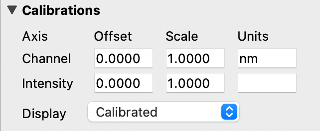

With a line plot selected, use the calibrations subsection to

* Change the offset, scale, and units of the x axis (Channel).

* Change the coordinate system. This will also change how the cursor position over a display item is shown in the Info panel. See :ref:`data-items` for more information.

.. _Session Inspector Section:

Session
-------
The Session subsection of the inspector allows you to change the session info for the selected item. 

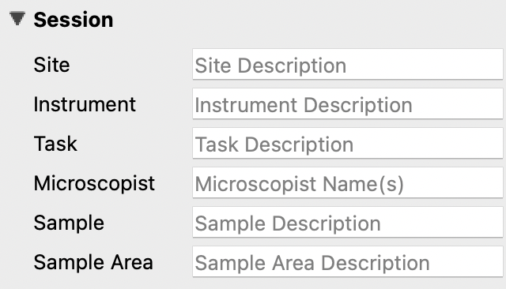

Editing session info in the inspector will not change global session info. Global session info is added to a data item when it is acquired or imported.

.. _Computation Inspector Section:

Computation
-----------
With the Computation subsection of the inspector, you can adjust several variables for a computation associated with the selected item.

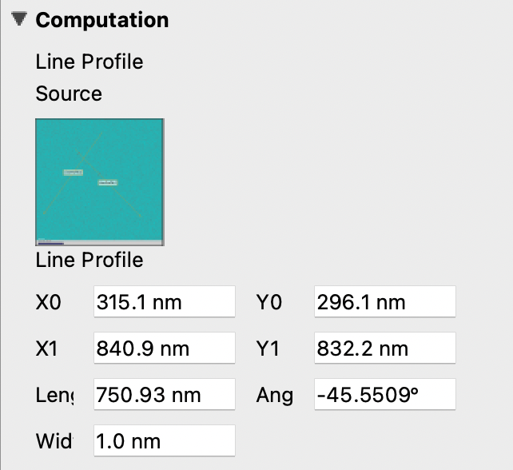

The variables in this subsection will change based on what kind of item is selected. For example, a line profile will have adjustments for the coordinates of each end of the line, the angle of the line, and the length and width of the line; whereas a processing filter like a gaussian blur may only have a single slider to adjust the sigma (or blur) value. If the selected item has no associated computations, the Computation subsection will say “None.”

The Computation subsection can also be accessed in a separate pop-up window by hitting [ctrl + E] (or [cmd + E] on macOS). 

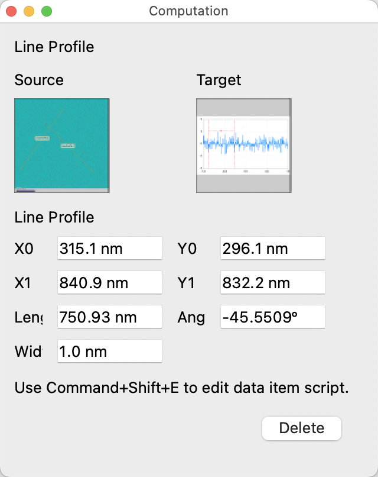

.. _Layers Inspector Section:

Line Plot Display Layers
------------------------
With this subsection, you can manage all aspects of the layers in a layered line plot. 

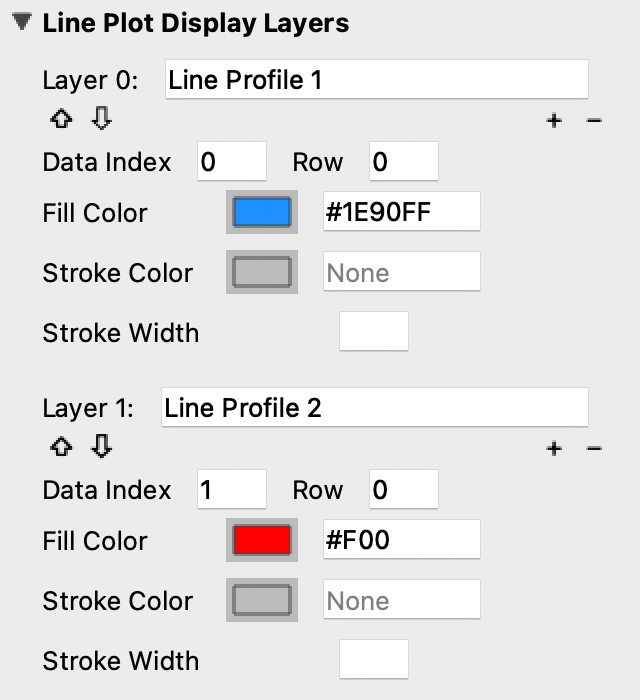

With the layered line plot selected, you can

* Change the order of layers using the up and down arrow buttons under the layer number.

* Add or remove layers with the plus and minus buttons to the right of the arrow buttons.
  
* Associate layers with data items in the stack using the text box labeled :guilabel:`Data Index`. Type the number of the data item as it appears in the stack. The first data item will be called “Data #0,” the second will be called “Data #1,” and so on. Type 0 or 1 into the text box to associate the layer with Data #0 or Data #1 respectively.

* Choose which row of a data item to show. If a data item has multiple rows, use the “Row” text box to choose which one is shown. Like data items, the row numbering will start at 0 and count up.

* Change the fill color and stroke color using the color or text boxes under each layer's section.

 * Change colors with text like rgb(100, 50, 200), #55AAFF, or a web-defined color like “Blue”
  
 * Choose colors with the color selection panel by clicking on the color box next to “Fill Color” or “Stroke Color.”

 * Input transparent colors with text like rgb(100, 50, 200, .5) or #55AAFF80.

 * Change the transparency of a color using the opacity sliders at the bottom of the color selection panel.

 * Choose no color by deleting any text from the text box next to “Fill Color” or “Stroke Color.” The text box will show a gray “None.”

* Change the stroke width by typing a number into the “Stroke Width” text box. This will create an outline of the stroke color around the associated layer.

.. _Graphics Inspector Section:

Graphics
--------
The Graphics subsection shows options for selected graphics, or for graphics associated with the selected data item. If multiple graphics are selected, the inspector will list options for all selected graphics.

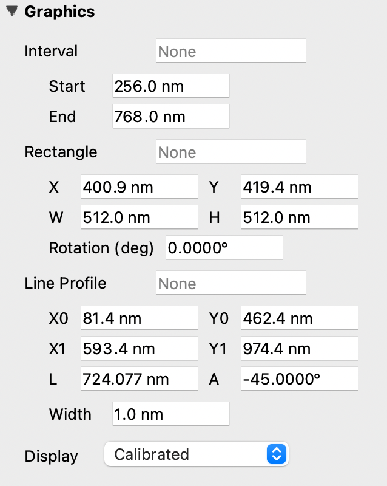

Each graphic will have different variables that can be changed in this subsection. Most of the variables can either be manipulated by text in the inspector panel or by moving points around in the display panel. The inputs and outputs for the variables will be based off of the coordinate system selected in the calibration drop-down. See :ref:`data-items` (Calibrations) for information on different types of coordinate systems. 

Each graphic will have some or all of the following variables:

* :guilabel:`Name` - The name of the selected graphic. To show no name on a graphic, remove all text from the name text box. The box will show a gray “None.”

* :guilabel:`X`, :guilabel:`Y` - The center coordinate of a graphic in nanometers (nm), pixels, or a decimal fraction depending on the coordinate system selected.

* :guilabel:`X0`, :guilabel:`Y0`, and/or :guilabel:`X1`, :guilabel:`Y1` - The coordinates of anchor points or vertices of a graphic in nanometers (nm), pixels, or a decimal fraction depending on the coordinate system selected.

* :guilabel:`W`, :guilabel:`H` - The width and height of a graphic in nanometers (nm), pixels, or a decimal fraction depending on the coordinate system selected.

* :guilabel:`L` - The length of a graphic in nanometers (nm), pixels, or a decimal fraction depending on the coordinate system selected.

* :guilabel:`A` - The angle of a graphic in degrees. Angle inputs over 180 degrees will be automatically reformatted into the equivalent negative angle. For example, an input of 225 degrees in the text box will be reformatted as -135 degrees.

* :guilabel:`Rotation` - The rotation of a graphic in degrees around its center point.

* :guilabel:`Start/End` - The end points of a graphic on a line plot in nanometers (nm), pixels, or a decimal fraction depending on the coordinate system selected.

* :guilabel:`Radius 1` - The outer radius of a ring mask in nanometers (nm), pixels, or a decimal fraction depending on the coordinate system selected.

* :guilabel:`Radius 2` The inner radius of a ring mask in nanometers (nm), pixels, or a decimal fraction depending on the coordinate system selected.

* :guilabel:`Mode` - The type of ring mask. See :ref:`graphics` for more information on ring masks.

* :guilabel:`Start Angle` - The top left inside angle of a wedge mask in degrees.

* :guilabel:`End Angle` - The inside opposite angle of a wedge mask in degrees.

* :guilabel:`Display` - The type of coordinate system used to label the coordinates on the image or line plot. See :ref:`data-items` for information on different types of coordinate systems.

.. _Metadata Panel:

Metadata
========
The Metadata utility panel shows any metadata associated with the selected data item. The session info will be added as metadata to any live data acquired during a given session.

.. _Output Panel:

Output
======
The Output panel displays output text at the bottom of the window while running Nion Swift. This is useful for debugging the application.

.. _Sessions Panel:

Session
=======
The Session panel allows you to edit the session info for the whole project rather than for a single data item. 

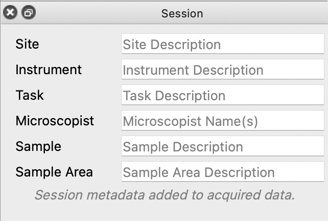

The session info will be added as metadata to any live data acquired during a given session. Every time Nion Swift is closed and reopened, a new session starts and global session info resets.

.. _Task Panel:

Task Panel
==========
The Task panel allows you to see the output from tasks such as microscope tuning. The output is often arranged into a table of data.

.. _Tool Panel:

Toolbar
=======
The Toolbar provides quick access to several options for the workspace. You can select items, move images, add graphics, create masks, choose image scale options, and edit the layout and content of display panels.

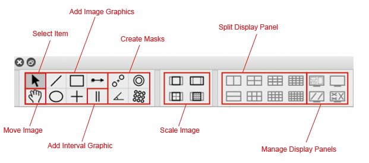

Some tools on the toolbar have key shortcuts. For example, hitting the lowercase E key will select the pointer tool. You can see the shortcuts for the various tools by hovering the cursor over the button for a tool.

.. _Recorder Dialog:

Recorder
========
.. records a data item, useful during live acquisition or adjustments
.. interval, number of frames
.. what does it produce?

The Recorder dialog allows you to record data at regular intervals from the display item selected when you open the recorder.

To record acquisition, click on the live acquisition display panel. Then open the Recorder dialog. Enter the desired interval (in milliseconds) and the number of items to record. Then click Record. The resulting data item will be a sequence of data sampled from the live data at regular intervals.

.. _Notifications Panel:

Notifications
=============
.. displays notifications, must be dismissed, global

The Notification dialog allows you to see notifications about errors and other important information that occurs while running the software.

The dialog will open automatically in the last location if a notification occurs. You must dismiss the notification and close the dialog.
